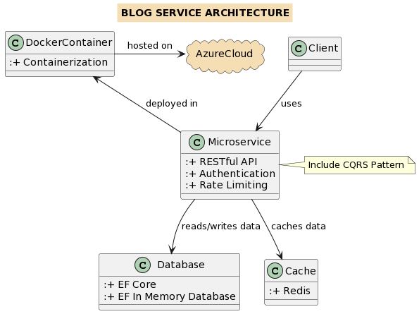

# Blog Service

## Overview

This repository contains the Blog Service, a microservices-based web application for managing blog posts and comments.

## Architectural Diagram

Below is the architectural diagram of the Blog Service:

## Components

- **Microservice**: The core service providing RESTful APIs for blog post and comment management. It includes rate limiting and authentication features.
- **Database**: Utilizes Entity Framework Core with an in-memory database for data persistence.
- **Cache**: Implements caching using Redis to enhance performance.
- **Docker Container**: The service is containerized for easy deployment and scalability.
- **Azure Cloud**: The application is deployed and hosted in Azure Cloud, ensuring high availability and robust performance.

## Features

- RESTful API for creating and retrieving blog posts and comments.
- Token-based authentication system.
- Basic rate limiting to prevent API abuse.
- CQRS (Command Query Responsibility Segregation) pattern implementation.

## Deployment

The application is containerized using Docker and deployed on Azure Cloud for seamless scalability and management.

## Getting Started

### Prerequisites

Before running the Blog Service application, ensure you have the following installed:
- Docker Desktop
- .NET 7 SDK

### Running Locally

To run the Blog Service locally:
1. Clone the repository to your local machine.
2. Navigate to the root directory of the project.
3. Use Docker Compose to build and run the application:

   docker-compose up

    https://localhost:7080/swagger/index.html

### Live Demo
 The link to the live demo on Azure platform :

 https://blogserviceapi-app-2023111813093.lemontree-bb291925.germanywestcentral.azurecontainerapps.io/swagger/index.html

